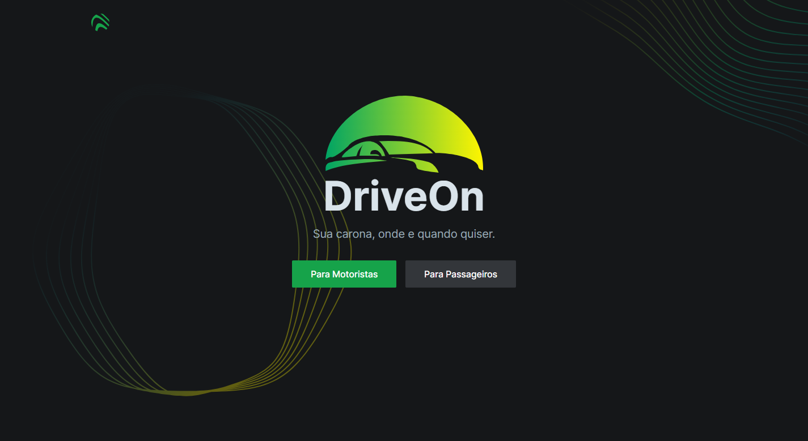
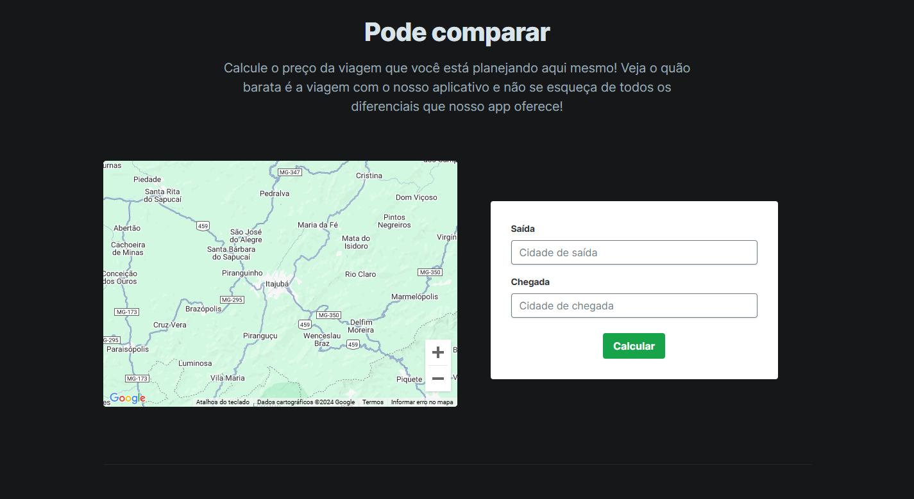
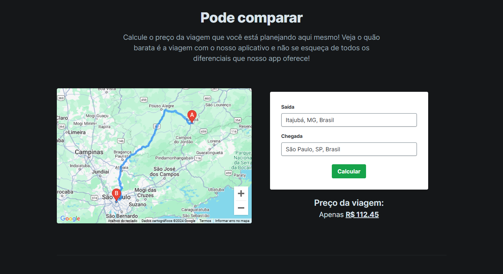
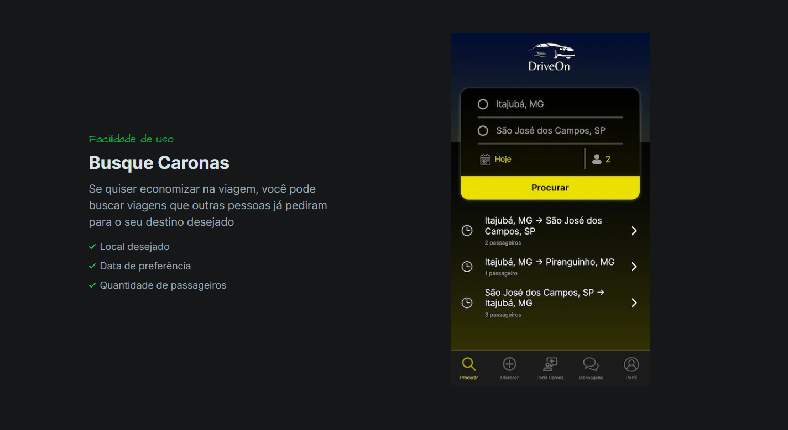

# DriveOn Landing Page



**DriveOn** é uma startup fictícia criada para a disciplina Gestão de Produtos Digitais ministrada por [Adler Diniz de Souza](http://lattes.cnpq.br/0659198149444462). Fui responsável pelo frontend da landing page, [Luan Munholi](https://github.com/LuanMunholi) foi responsável pelo frontend do aplicativo (prototipado através do website Framer).

O presente repositório contém o código para a landing page do projeto, desenvolvido em Next.js e auxiliado por Tailwind CSS.

## Execução

Este repositório pode ser clonado e executado diretamente através do comando:

```bash
npm run dev
# or
yarn dev
# or
pnpm dev
```

E em seguida abrir [http://localhost:3000](http://localhost:3000) com seu navegador para a visualização. Não há integração com um backend externo.

Para a integração com o Google Maps API, é necessária a inserção do arquivo .env.local com a chave `NEXT_PUBLIC_GOOGLE_MAPS_API_KEY` que pode ser obtida através do console do Google. A chave é restrita às seguintes APIs:

- Maps JavaScript API
- Maps Static API
- Maps Embed API
- Maps Elevation API
- Places API
- Geocoding API
- Geolocation API
- Directions API

Caso seja configurada corretamente, o cálculo de custo de viagem poderá ser utilizado.

## Features

Integração com Google Maps


Cálculo utilizando o retorno da API e exibição da rota (preço demonstrativo apenas)


CTA com as funcionalidades do aplicativo



## Créditos
- [Open react template by Cruip](https://open.cruip.com/)
- [Nucleo](https://nucleoapp.com/)